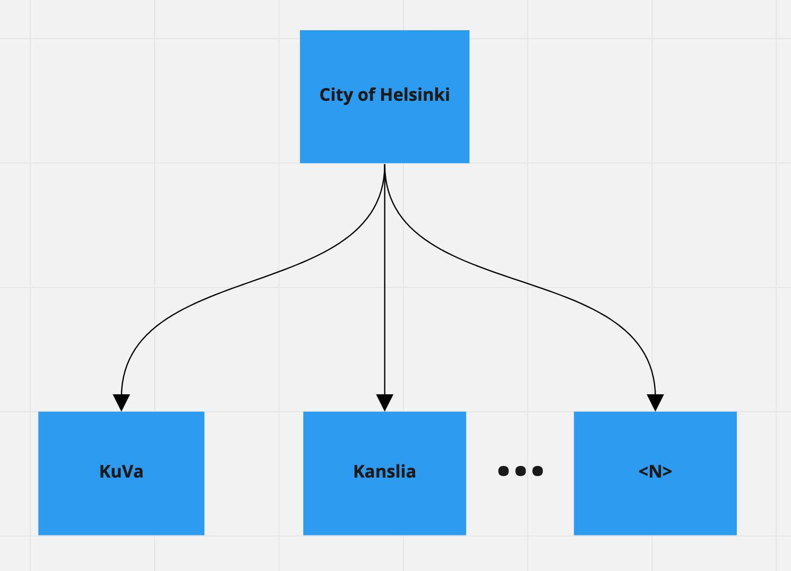

## New developer to the team? Welcome! 👋

<!-- vim-markdown-toc GFM -->

* [Get started here](#get-started-here)
* [Understand City of Helsinki organization as a developer](#understand-city-of-helsinki-organization-as-a-developer)
* [Ensure that you have access to essential services you need as a developer](#ensure-that-you-have-access-to-essential-services-you-need-as-a-developer)
* [Ensure that you have setup all that is required to operate within a team](#ensure-that-you-have-setup-all-that-is-required-to-operate-within-a-team)
* [Get to know people!](#get-to-know-people)
* [Get a general sense of how we develop software in City of Helsinki](#get-a-general-sense-of-how-we-develop-software-in-city-of-helsinki)
* [Get your service up and running](#get-your-service-up-and-running)
* [You're done, thank you!](#youre-done-thank-you)

<!-- vim-markdown-toc -->

----

### Get started here

* This is an onboarding checklist for software developers who join City of Helsinki to get them started!
* The ultimate goal of this checklist is to get you from the moment you start working here to taking a dev ticket as smoothly as possible 🧡
* This checklist is meant to complement the physical developer onboarding meeting which happens in the first half of the day of your 1st day.
* The expectation is that you would be **proactive** and read and implement the steps in this checklist pragmatically.
* We know there's plenty of things you need to setup, and therefore we won't ask you to take a dev ticket before you tell us that you're done with this checklist ✅
* It is fine if you spend ~2 working days to complete this checklist. Or more if needed by letting your tutor know.

### Understand City of Helsinki organization as a developer

* City of Helsinki has plenty of separate departments, [[KuVa specific:]] from which the most important ones you'll be dealing with are **KuVa** and **Kanslia**.
* KuVa (Kulttuuri ja Vapaa-aika) is the Culture and Leisure department and Kanslia (Kaupunginkanslia) is the executive office.  All departments are listed [on this page](https://www.hel.fi/helsinki/fi/kaupunki-ja-hallinto/hallinto/organisaatio/toimialat).  Kymp = Kaupunkiympäristö, Kasko = Kasvatus ja koulutus, Sote = Sosiaali- ja terveysala
* The different departments have:
    * Their own budgets
    * Their own development goals
    * Their own office space
    * Their own developers
    * Their own infrastructure they deploy their services to
* Some of the services developed by Kanslia are heavily used by some KuVa services, and some Kuva services are deployed by Kanslia.
* Your onboader on the first day should tell you whether you're working in KuVa or Kanslia, if location of office or other things haven't given it away already 😀

### Ensure that you have access to essential services you need as a developer
* Choose an email address of your own that you'd like to use for working in City of Helsinki.
    * Unless you're working for City of Helsinki itself, as a developer, you won't get hel.fi email accounts, but this might change in the future.
* Choose your Github and Gitlab username that you'd like to use for working in City of Helsinki.
* Give your email and Github and Gitlab usernames to your onboarder so they can give you access to:
    * [City of Helsinki Slack](https://helsinkicity.slack.com/)
    * [Helsinki's Atlassian for Jira, Confluence, etc](https://helsinkisolutionoffice.atlassian.net/wiki/spaces/DD/overview)
    * [[KuVa specific:]] [KuVa's Gitlab](https://gitlab.com/City-of-Helsinki/KuVa)
    * [[KuVa specific:]] [KuVa's Github team](https://github.com/orgs/City-of-Helsinki/teams/kuva-developers/members)
* Skim through [this page in Jira](https://helsinkisolutionoffice.atlassian.net/wiki/spaces/DD/pages/851980/Services+and+accounts+for+new+developers) and see if any of
the items there are relavent to you as well.

   * We should ideally remove that page and move its `onboardee` items to here, and it's `onboarder` items to [onboarder's checklist](https://helsinkisolutionoffice.atlassian.net/wiki/spaces/DD/pages/416940090/Onboarding+checklist).

* [Optional] City of Helsinki heavily uses Jira, Slack, and Teams for tasks management and video calls.
You may want to install native clients of those for your operating system or bookmark them for easier access.

### Ensure that you have setup all that is required to operate within a team
* [[AOK (KuVa, Kanslia) specific:]] `Stadinetti` is our wi-fi of choice at the office which you may connect to if you want.
    * There are a few known issues related to `Stadinetti` like IMAP not working or hanging on inital connection to Google which are being investigated.
    * Because of this, some folks hotspot their internet from their phones and connect to internet like that.
* Learn [how to report your working hours](https://helsinkisolutionoffice.atlassian.net/wiki/spaces/DD/pages/30015547/Work+hours+tracking).
* Learn the [basics of working with Jira](https://helsinkisolutionoffice.atlassian.net/wiki/spaces/DD/pages/753745/Jira+instructions) if you aren't familiar with it already.
* [[KuVa specific:]] Integrate [KuVa's calendar](https://helsinkisolutionoffice.atlassian.net/wiki/spaces/DD/pages/47677441/Calendar+usage) into your calendar workflow.
* Based on the team you've joined in your physical developer onboarding meeting, ensure that you know exactly which team's daily and
sprint demo/retro/planning/refinement you should join on your calendar.

### Get to know people!
* You should have been assigned a tutor by your onboarder in the physical developer onboarding meeting.
* Your tutor is your go-to buddy and you can ask all your questions from them.
* [[KuVa specific:]] Write a few lines to introduce yourself to everyone in `#kuva-aok` Slack channel.
* Your team members should ideally pick you up for lunch themselves, but in the hopefully-unlikely scenario that they forget, feel free to ask and tag along with them! 👍
* [[KuVa specific:]] Start an opinionated discussion about whatever on `#ratkis-kitchenette` as that is the fun 😀 slack channel and the place to be!
* [[KuVa specific:]] You can also take a look at the list of [people working here](https://helsinkisolutionoffice.atlassian.net/wiki/spaces/DD/pages/753891/People) and contact some/any of them
you feel their work is interesting and ask them what they're doing work-wise for example!

### Get a general sense of how we develop software in City of Helsinki
* You don't have to understand everything at the detail level, that's more info than one can handle in a few days, especially during the first days!
* We'd like you, however, to try to construct a high level image of software development practices that we have in City of Helsinki.
* This means what technologies we use and why, how and where we deploy, how we git, etc.
* The highest level document of our [development practices is here](https://helsinkisolutionoffice.atlassian.net/wiki/spaces/DD/pages/65679/Development+practices).
* You can read the main page of the document practices completely, and **sneak peak** into the linked children pages to get the high level image you'd need and be
able to get back to them later upon need.

### Get your service up and running
* Each service developed in City of Helsinki has a purpose and you should familiaze yourself with this purpose
[for the service you're going to develop](https://helsinkisolutionoffice.atlassian.net/wiki/spaces/DD/pages/655463/Services).
* Get the local development environment of the repository you'll be coding in up and running **using README.md**
    * **This is an important step** because it would not make sense to start coding a feature if a new team member cannot effortlessly get the dev env up and
    running based on README.md instructions.
    * If you didn't manage to get it running with README.md instructions, please take ownership of the repository straight away and update the README.md with the steps
    necessary so that the next developer doesn't have to get *unwritten knowledge* to be able to get the dev env up and running.
* Ensure that the items within "*what should README.md contain?*" section of
[documentation practices](https://helsinkisolutionoffice.atlassian.net/wiki/spaces/DD/pages/753772/Documentation+practices) are already taken care of, or write them yourself if they aren't.

### You're done, thank you!
* At this point, you're ready to ask your team members or your tutor for a dev task of sensible difficulty.
* Ask your team members for feedback to see if they think you're doing fine and how to take it from here onwards.
* Please consider updating this checklist if you feel that now you're settled here to prevent this list going out of date and causing new team members confusion and hassles.
